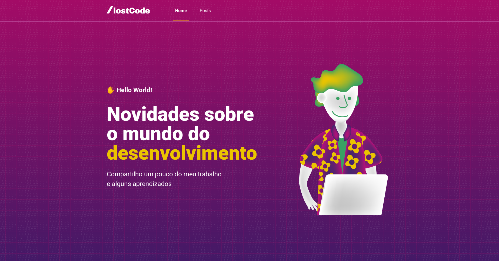

<h1 align="center">
  💻 Blog - Lost Code
</h1>

<h4 align="center"><a href="https://lostcode-blog-ten-liard.vercel.app/">Clique para visitar o projeto</a></h4>

## 📚 Seções

O site é composto por alguma páginas principais:

- **Home:** Nele temos o feed princial do usuário;
- **Search:** Nessa página podemos buscar por conteúdo e pessoas;
- **Gallery:** Temos as galerias do usuário sendo pública ou não;
- **Communities:** Temos as comunidades de filmes, séries e músicas;

---

## 💼 Tecnologias utilizadas

Para o desenvolvimento desta aplicação é utilizado as seguintes tecnologias:

- HTML;
- Sass;
- Vue 3;
- Vue Router;
- Vuex;
- Node.js;
- Mongoose;
- MongoDB;

---

<h2>Contribuidores</h2>

<table>
  <tr>
    <td align="center">
      <a href="https://github.com/daniel-soaress">
         
        
          <b>Daniel Soares</b>
        
      </a>
    </td>
    <td align="center">
      <a href="https://github.com/riberotais">
         
        
          <b>Taís Ribeiro</b>
        
      </a>
    </td>
  </tr>
</table>
